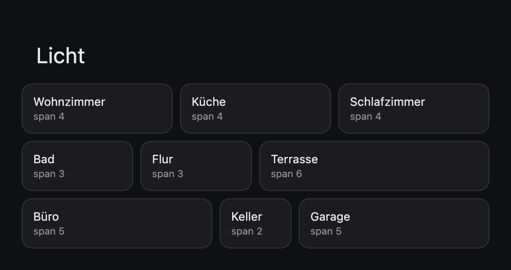
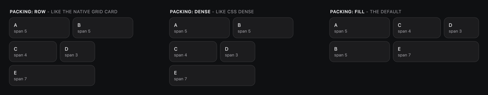
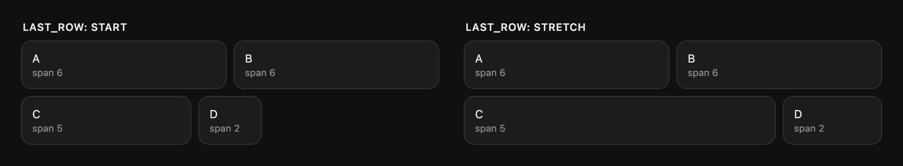
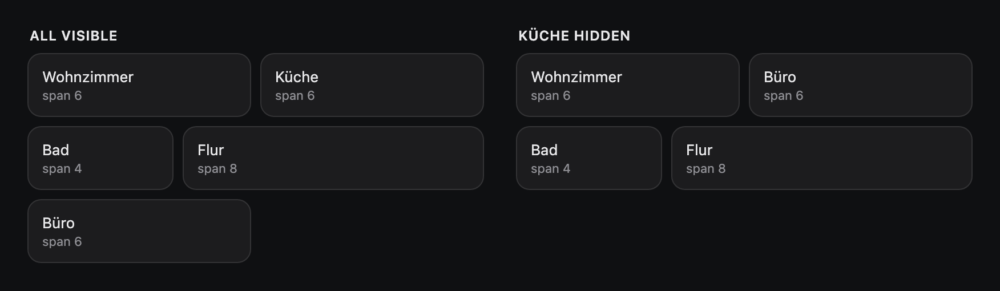
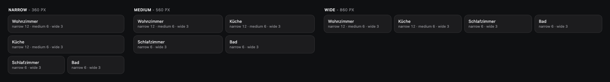

# Advanced Grid Card

A grid card for Home Assistant where every card sets its own width, and the
rows are packed so that as little room as possible stays empty.

One file to install, no dependencies. The child cards stay ordinary Lovelace
cards: the width is a key the grid reads and removes before the child sees
its configuration.

[](https://github.com/julezdean/lovelace-advanced-grid-card/actions/workflows/ci.yml)
[](https://github.com/hacs/integration)
[](https://github.com/julezdean/lovelace-advanced-grid-card/releases)



---

## Contents

- [Installation](#installation)
- [Quick start](#quick-start)
- [How the layout works](#how-the-layout-works)
- [Configuration reference](#configuration-reference)
- [Different widths for different card sizes](#different-widths-for-different-card-sizes)
- [The visual editor](#the-visual-editor)
- [Behaviour details](#behaviour-details)
- [Development](#development)

---

## Installation

Requires Home Assistant 2024.6 or later.

### HACS

[](https://my.home-assistant.io/redirect/hacs_repository/?owner=julezdean&repository=lovelace-advanced-grid-card&category=plugin)

That button opens the repository straight in your HACS. Install it there, then
reload the browser (Ctrl/Cmd-Shift-R).

Adding it by hand instead:

1. HACS → three-dot menu → **Custom repositories**
2. Repository: `julezdean/lovelace-advanced-grid-card`, category **Dashboard**
3. Install **Advanced Grid Card**

### Manual

1. Download `advanced-grid-card.js` from the
   [latest release](https://github.com/julezdean/lovelace-advanced-grid-card/releases/latest)
   and copy it to `<config>/www/advanced-grid-card.js`
2. **Settings → Dashboards → three-dot menu → Resources → Add resource**
   - URL: `/local/advanced-grid-card.js`
   - Type: **JavaScript module**
3. Reload the browser

Confirm it loaded: the browser console prints `advanced-grid-card v0.2.0-beta.1` on
startup.

---

## Quick start

```yaml
type: custom:advanced-grid-card
columns: 12
cards:
  - type: tile
    entity: light.wohnzimmer
    grid_span: 3
  - type: tile
    entity: light.kueche
    grid_span: 3
  - type: tile
    entity: light.schlafzimmer
    grid_span: 6
  - type: tile
    entity: light.bad
    grid_span: 4
  - type: tile
    entity: light.flur
    grid_span: 8
```

`columns: 12` divides the card into twelve equal columns. `grid_span: 3` makes
a card three of them wide - a quarter. The gaps between cards are part of the
arithmetic: two cards of span 3 are exactly as wide as one of span 6.

```text
columns: 12
| 1 | 2 | 3 | 4 | 5 | 6 | 7 | 8 | 9 | 10 | 11 | 12 |

grid_span: 3    |--- 3 ---|                           a quarter
grid_span: 6    |---------- 6 ----------|             half
grid_span: 12   |------------------ 12 -------------| the full width (also: full)
```

---

## How the layout works

A card that does not fit into the rest of its row starts a new row. What
happens to the room it leaves behind is what `packing` decides:



| `packing` | What it does | Order on screen |
|---|---|---|
| `fill` (default) | Each row starts with the earliest card not yet placed, then takes the combination of later cards that fills it best. Among equally good combinations, the earliest cards win. | The first card is always top left and every row starts with the oldest card still waiting, so the order reads roughly top to bottom. |
| `dense` | Each card goes into the first row that still has room for it - what CSS `grid-auto-flow: dense` does. It never looks ahead. | A card moves up only when it fits a gap. |
| `row` | Strictly in YAML order - what the native grid card and the sections view do. | Exactly the YAML order. |

With the five cards above (spans 5, 5, 4, 3, 7) `row` and `dense` both need
three rows and leave 12 columns empty; `fill` needs two, both full.

**When nothing needs to move, nothing moves.** If the YAML order already fills
every row, `fill` gives the same layout as `row`. The overview image at the
top is such a case: 4+4+4, 3+3+6, 5+2+5.

**How good `fill` is.** It is a heuristic, not a search for the optimum.
Measured against the smallest possible row count (exhaustive search) over
2000 random grids of 4-12 cards on 12 columns, it found it in 93% of the cases
with spans 2-8 and in 95% with spans 1-12; `dense` in 80% and 84%, `row` in
50% and 44%. Laying out 60 cards takes about 0.04 ms.

**Within a row cards keep their YAML order**, left to right, whatever the
strategy.

### The last row

`last_row: stretch` hands the columns the last row leaves free to its cards,
in proportion to their spans and in whole columns. Only the last row, and
only when asked: afterwards the spans in that row are no longer what the YAML
says.



---

## Configuration reference

### Card options

| Option | Default | Description |
|---|---|---|
| `cards` | *required* | The child cards. Any Lovelace card, including other grids. |
| `columns` | `12` | How many columns the card is divided into. |
| `gap` | `var(--grid-card-gap, 8px)` | Space between cards: a number (px) or any CSS length. The default is the native grid card's, through the same theme variable. |
| `packing` | `fill` | `fill`, `dense` or `row` - see [How the layout works](#how-the-layout-works). |
| `last_row` | `start` | `start` leaves the last row as it is, `stretch` widens its cards to the full width. |
| `default_span` | `1` | The span of cards without `grid_span`. `1` is what the native grid card does, so a `type: grid` switched to this card looks the same until you give spans. |
| `title` | - | A heading above the grid, styled like the stack and grid cards'. |

### On each child card

| Option | Description |
|---|---|
| `grid_span` | How many columns the card covers: a whole number, `full`, or one value per card size (see below). Wider than `columns` means the full width. |

`grid_span` is removed before the child card receives its configuration, so a
card that refuses keys it does not know is not bothered by it.

`visibility` works on every child card as it does anywhere in Home Assistant,
and so do conditional cards. A hidden card takes no room: the grid is laid out
again without it.



When every child card is hidden, the grid card hides itself as well.

---

## Different widths for different card sizes

On a phone, a quarter of the width is too narrow to tap. `grid_span` can
therefore take one value per size of the card:

```yaml
- type: tile
  entity: light.wohnzimmer
  grid_span: { narrow: 12, medium: 6, wide: 3 }
```

| Name | The card is |
|---|---|
| `narrow` | less than 400 px wide |
| `medium` | 400-799 px wide |
| `wide` | 800 px or wider |

What counts is the width of **this card**, not of the screen: a card in one
narrow section of a large monitor is `narrow` too.

A size you leave out takes the next smaller one you gave, and failing that
the next larger. `{ narrow: 12, wide: 3 }` is 12 at `medium`.



---

## The visual editor

The card has a visual editor, laid out like Home Assistant's own grid card
editor: the card's options on top, then one tab per card with that card's own
editor.

- **Tabs** show each card's position and width - `2 · 3`, or `2 · 12/6/3` for
  one width per card size. With `fill` the order on screen can differ from the
  order of the tabs; the width is what finds a card again in the preview.
- **Width** above each card's editor: a number of columns, or, with *Different
  widths per card size*, one each for narrow, medium and wide. Left empty, the
  card takes the default width. A `grid_span: full` from the YAML stays `full`
  as long as the number shown for it is not changed.
- **Each card's own editor** is Home Assistant's, including the visibility
  tab. It never sees `grid_span`: Home Assistant's card editors refuse keys
  they do not know and would switch to "visual editor not supported".
- **Move, copy, cut and delete**, as in Home Assistant's editor. Copying uses
  Home Assistant's card clipboard, so a card copied in Home Assistant's own
  editors can be pasted here. A card copied here reaches Home Assistant's
  card picker only after the page has been reloaded - it reads the clipboard
  once per page load - so the "add card" tab offers its own paste button.
  A copied card leaves its `grid_span` behind.
- Options left at their default are not written to the YAML, and options the
  editor cannot show - `gap: 0.5rem` - are left alone unless you change them.

If Home Assistant's card editors cannot be loaded, the card's options stay
editable and the cards are edited in the code editor.

---

## Behaviour details

- **The card has no surface of its own**, like the native grid and stack
  cards: each child card brings its own background and border.
- **Rows are as tall as their tallest card.** Packing works on widths; a short
  card next to a tall one leaves room below it.
- **The order in which the keyboard moves through the cards is the YAML order**,
  which with `fill` and `dense` can differ from the order on screen. Use
  `packing: row` where that matters.
- **Sections view:** the card asks for the full width of the section and for
  as much height as its rows need.
- **Masonry view:** the card reports the height of its rows, each as tall as
  its tallest child.
- **Edit mode** shows every card, hidden or not, as Home Assistant does
  elsewhere; the layout then includes them.
- **Right-to-left languages** mirror the grid.
- **Mistakes in the configuration** are shown in place of the card, with the
  field named - `cards[2].grid_span: unknown width "mobile" - use narrow,
  medium, wide`.

---

## Development

The card is written in TypeScript under `src/` and bundled into the single
file Home Assistant loads. That file is built, not committed: a release
attaches it as an asset, which is where HACS looks first.

```bash
npm install
npm run build            # dist/advanced-grid-card.js
npm run check            # formatting, lint, types, build, tests - what CI runs
npm run screenshots      # build, then regenerate docs/images/ from the demo harness
```

`src/main.ts` describes the layout of the source. The layout engine in
`src/layout/` is pure functions without DOM; its tests compare `fill` against
an exhaustive search for the smallest row count.

The child cards are created through Home Assistant's `hui-card` element, the
same way the native stack and grid cards create theirs. That is what gives
them `visibility` and conditional cards with exactly Home Assistant's
behaviour - and it is the one internal of the frontend this card depends on.

`tools/demo/` is a harness that imports the built `dist/advanced-grid-card.js`
with a stand-in for `hui-card` (same interface, same way of hiding), so the
images in this README always show the current code. Run `npm run build`,
serve the repo root and open `tools/demo/index.html?scene=packing`.

Scenes: `overview`, `packing`, `responsive`, `visibility`, `last-row`, and
`editor`.

The `editor` scene is for development only and is deliberately not
screenshotted: it renders against stand-ins for Home Assistant's `ha-form`,
card editor and card picker, so an image of it would show forms that exist
nowhere. It does verify the wiring - forms and the child's editor fed and
read back, `grid_span` kept out of the child's editor, move, copy, cut, paste
and delete, `config-changed` emitted only for real changes.

The window sizes in `tools/screenshots.sh` are measured, not guessed - if you
change a scene, re-measure and update them.
